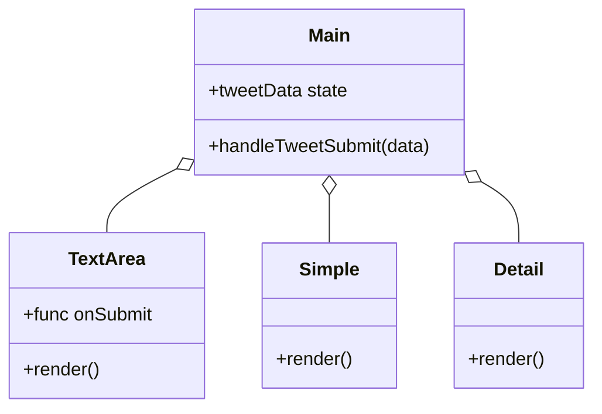

# ReactTweetApp

## 概要
ReactTweetAppは、ツイートの投稿とプレビューを行うシンプルなReactアプリケーションです。

## 特徴
- ツイートの投稿機能
- ツイートのリアルタイムプレビュー
- シンプルで直感的なユーザーインターフェース

## このプロジェクトを通して学べること・習得できること
- Reactの基本的な使い方
- 状態管理の実践
- ESLintとPrettierを用いたコードの品質管理
- AirbnbのESLint構成の理解

## 必要条件
- Node.js（推奨バージョン: 14.x以上）

## インストール手順
1. リポジトリをクローンします:
    ```bash
    git clone https://github.com/ksk-aiko/ReactTweetApp.git
    cd ReactTweetApp
    ```
2. 依存関係をインストールします:
    ```bash
    npm install
    ```

## 使用方法
1. 開発サーバーを起動します:
    ```bash
    npm start
    ```
2. ブラウザで `http://localhost:3000` にアクセスします。

## 機能一覧
- ツイートの投稿
- ツイートのリアルタイムプレビュー

## 技術スタック
- React
- ESLint
- Prettier

## 追加資料
現在のところ、追加資料はありません。

## 貢献方法
1. このリポジトリをフォークします。
2. 新しいブランチを作成します:
    ```bash
    git checkout -b feature/your-feature-name
    ```
3. 変更をコミットします:
    ```bash
    git commit -m 'Add some feature'
    ```
4. ブランチにプッシュします:
    ```bash
    git push origin feature/your-feature-name
    ```
5. プルリクエストを作成します。

## ライセンス
このプロジェクトはMITライセンスの下でライセンスされています。

## クラス図


## シーケンス図
```mermaid
sequenceDiagram
    participant User
    participant TextArea
    participant Main
    participant Simple
    participant Detail

    User->>TextArea: 入力データを送信
    TextArea->>TextArea: データ検証
    TextArea->>Main: リフトアップ（データ送信）
    Main->>Main: データを状態に保存
    Main->>Simple: シンプルプレビュー表示データを渡す
    Simple->>Simple: プレビューをレンダリング
    Main->>Detail: 詳細プレビュー表示データを渡す
    Detail->>Detail: プレビューをレンダリング